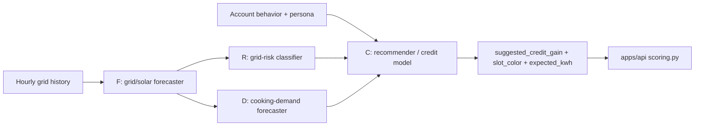
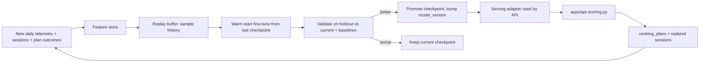

# GridCook Model Suite

Neural-network model suite that learns from the Oloika clean-cooking dataset to
recommend the best time to cook, forecast grid conditions, and estimate reward
credits. It is designed for **continual learning**: it trains on the historical
month and then keeps adapting as new telemetry, cooking sessions, and plan
outcomes stream in.

This directory currently contains design documentation only. Training code is
added in a later step; the folder layout below is the agreed target.

---

## 1. Purpose and scope

The API in [`apps/api`](../api/README.md) today answers "when should I cook?"
and "how many credits will I earn?" with a transparent rules baseline
(`model_version = "rules-v1"` in
[`apps/api/gridcook/scoring.py`](../api/gridcook/scoring.py)). This model suite
replaces those heuristics with learned models (`model_version = "nn-v1"`) while
keeping the exact same API contract, so nothing downstream has to change.

Scope of the suite:

- Forecast near-term grid conditions (solar, battery, load).
- Classify each hour as a `green` / `orange` / `red` cooking window.
- Forecast cooking demand (sessions and energy) per hour and per account.
- Recommend per-account cooking windows and the `suggested_credit_gain` a user
  would earn for a chosen time.

Non-goals: this is not a production forecasting system. The dataset is a single
synthetic month, so the emphasis is on a correct, honest pipeline with strong
baselines and a graceful fallback, not on state-of-the-art accuracy.

---

## 2. Why continual learning here

A clean-cooking mini-grid is a moving target, so a model trained once goes stale
quickly:

- **Streaming telemetry.** New hourly grid readings and cooking sessions arrive
  every day. The model should incorporate them, not wait for a quarterly rebuild.
- **Concept drift.** Solar output shifts with seasons and weather; community load
  changes as appliances are added; tariffs and incentives evolve.
- **Population growth.** New households and businesses join the mini-grid, so the
  per-account behavior distribution keeps changing.
- **Feedback effect.** The recommendations themselves change behavior (people
  shift cooking to green windows), which the model must keep learning from.

The chosen strategy is **replay-based periodic fine-tuning** (see section 6): it
adapts to new data without forgetting the historical patterns, and it only
promotes a new model when it demonstrably beats the current one and the
baselines.

---

## 3. Model suite

Four small models that compose. F feeds R and D; F/R/D feed C. Each stays small
on purpose given the data size.

| ID | Model | Input | Output | Target/labels | Loss | Primary metric |
| --- | --- | --- | --- | --- | --- | --- |
| F | Grid/solar forecaster | Sequence of past hourly grid features | Next-24h `pv_power_w`, `battery_soc_percent`, `ac_load_w` | Future grid rows | MSE | MAE vs hour-of-day baseline |
| R | Grid-risk classifier | Current or forecast grid features for an hour | `green` / `orange` / `red` | Dataset `slot_color` | Cross-entropy | Macro-F1, confusion vs rule labels |
| D | Cooking-demand forecaster | Hour-of-day, calendar, grid features (+ account for per-account variant) | Expected sessions and kWh per hour | Aggregated `cooking_sessions` | MSE / Poisson | MAE vs hour-of-day baseline |
| C | Recommender / credit model | Account behavior + persona + F/R/D outputs for a candidate hour | Slot suitability + expected kWh -> `suggested_credit_gain` | Realized sessions + plan outcomes | Multi-task (CE + MSE) | Credit MAE, green-hour ranking, vs `rules-v1` |

Notes:

- **F (forecaster).** A compact GRU or temporal conv net over the hourly series.
  Enables "cook later today" recommendations rather than only same-hour advice.
- **R (risk classifier).** A small MLP. The dataset's `slot_color` is the initial
  label; as operators validate real safety windows, R can be retrained on those.
- **D (demand).** Predicts load pressure from cooking so the operator can see when
  many users are likely to cook at once (`peak_concurrent_cookers`).
- **C (recommender/credit).** The model that the API consumes. It outputs the same
  fields as the rules engine (`suggested_credit_gain`, `credit_gain_basis`,
  `model_version`) so it is a drop-in replacement.

---

## 4. Data and features

Source of truth is `data/synthetic/` (the same files the API loads; schema in
[`docs/oloika_data_schema_and_prediction_notes.md`](../../docs/oloika_data_schema_and_prediction_notes.md)).

Feature groups:

- **Grid hour** (from `oloika_grid_hourly_june_2025.csv`): `hour_eat`,
  `pv_*_power_w`, `battery_soc_percent`, `battery_power_w`, `ac_load_w`,
  `voltage_avg_v`, `system_alarm_count`, plus cyclical encodings of hour and day.
- **Account behavior** (from `oloika_account_daily_behavior_june_2025.csv`):
  historical session hour, kWh, `green_window_share`, red-window sessions,
  shifted-daytime sessions, credit history.
- **Persona** (from `oloika_households.csv` / `oloika_commercial_profiles.csv`):
  account type, fuel stack, primary/secondary equipment, meal windows,
  shiftability score, clean-cooking readiness.
- **Cooker state** (from `oloika_cooker_assets.csv` / utilization): cooker id,
  observed-vs-synthetic source, recent utilization.

Sequence windows: F consumes rolling windows of hourly features (e.g. previous
48-72h) to predict the next 24h. R/D/C operate per-hour with the relevant grid
and account context.

Label construction and feedback loop: R uses `slot_color`; D aggregates
`cooking_sessions`; C is trained on realized sessions joined to the `cooking_plans`
a user booked (planned hour + suggested credit vs what actually happened),
closing the loop between recommendation and outcome.

---

## 5. Architecture

How the models compose at inference time:



Continual-learning loop as new data arrives:



---

## 6. Continual learning strategy

The core loop is **replay-based periodic fine-tuning**:

1. **Ingest.** A new batch of data (e.g. a day of telemetry, sessions, and plan
   outcomes) is appended to the feature store.
2. **Replay sample.** Draw a mix of the new batch plus a sampled buffer of
   historical examples. Mixing history is what prevents catastrophic forgetting.
3. **Warm-start fine-tune.** Continue training from the current checkpoint (not
   from scratch) for a small number of steps with a low learning rate.
4. **Validate.** Evaluate the candidate on a held-out slice against (a) the
   currently deployed checkpoint and (b) the non-learned baselines.
5. **Promote or keep.** Only promote the candidate — and bump `model_version` — if
   it is at least as good as the current model and beats the baselines. Otherwise
   keep the current checkpoint. This guarantees quality never silently regresses.

Supporting mechanisms:

- **Replay buffer.** Reservoir or stratified sampling over history so older
  regimes remain represented.
- **Catastrophic forgetting.** Handled primarily by replay; optional
  regularization (e.g. EWC) can be added later if drift is severe.
- **Drift monitoring.** Track input-feature and label distribution shifts and
  rolling validation error; trigger fine-tuning or alerts when they cross a
  threshold.
- **Schedule.** Default is a periodic (e.g. nightly) fine-tune, plus an on-demand
  trigger when enough new data or drift has accumulated.

---

## 7. Folder structure (target)

```text
apps/model/
├── README.md                     # this document
├── requirements.txt              # torch, numpy, pandas, scikit-learn
├── gridcook_model/
│   ├── data/
│   │   ├── dataset.py            # load data/synthetic, build feature frames + windows
│   │   ├── features.py           # feature engineering (grid, account, persona, temporal)
│   │   └── replay.py             # replay buffer for continual learning
│   ├── models/
│   │   ├── base.py               # shared NN base, save/load, config
│   │   ├── grid_forecaster.py    # F
│   │   ├── risk_classifier.py    # R
│   │   ├── demand_forecaster.py  # D
│   │   └── recommender.py        # C
│   ├── training/
│   │   ├── trainer.py            # generic train loop
│   │   ├── continual.py          # replay-based fine-tune + promotion
│   │   └── evaluate.py           # metrics + baselines
│   ├── registry/
│   │   └── registry.py           # checkpoint + model_version registry
│   └── serving/
│       └── inference.py          # loads latest checkpoints; adapter used by the API
├── checkpoints/                  # saved model versions (gitignored)
└── scripts/
    ├── train_all.py              # initial training on the historical month
    ├── ingest_new_data.py        # ingest a new batch -> continual update
    └── export_for_api.py         # export the promoted model for API serving
```

---

## 8. Training and inference workflows (planned)

These commands describe the intended workflow once code lands; they are not yet
runnable.

```bash
cd apps/model
python3 -m venv .venv && source .venv/bin/activate
pip install -r requirements.txt

# Initial training on the historical month
python3 scripts/train_all.py

# Continual update as a new batch of data arrives
python3 scripts/ingest_new_data.py --batch <path-or-date>

# Export the promoted checkpoint for the API to serve
python3 scripts/export_for_api.py
```

---

## 9. API integration

The recommender (C) is a drop-in for the rules engine and keeps the API schema
identical:

- Same response fields: `suggested_credit_gain`, `credit_gain_basis`,
  `model_version`.
- When a promoted checkpoint exists, the API's serving path uses it and reports
  `model_version = "nn-v1"`.
- When no checkpoint is available (fresh clone, training not yet run), the API
  **falls back gracefully** to the existing `rules-v1` logic in
  [`apps/api/gridcook/scoring.py`](../api/gridcook/scoring.py). The demo therefore
  always works, with or without a trained model.

---

## 10. Evaluation protocol and baselines

Every model is compared against non-learned baselines; a learned model only ships
if it wins.

- **Temporal split.** Train on the early part of the month (e.g. June 1-23) and
  test on the later days, so evaluation reflects forecasting future hours rather
  than interpolating.
- **Baselines.** Hour-of-day average (for F and D), the dataset `slot_color`
  rules (for R), and `rules-v1` (for C).
- **Metrics.** MAE for regression (F, D), macro-F1 and confusion matrix for R,
  and credit MAE plus green-hour ranking quality for C.
- **Promotion gate.** In the continual loop, a candidate must beat both the
  current checkpoint and the baseline on the holdout to be promoted.

---

## 11. Data limitations and honesty caveats

- The dataset is a **single synthetic month** (~720 grid-hours, ~2,740 sessions,
  84 accounts, only 8 observed smart-plug groups). This is enough for a credible
  pipeline demo, not for production accuracy.
- Deep networks would overfit at this scale, so models stay deliberately small and
  are always benchmarked against transparent baselines.
- Health and clean-cooking impact fields are **proxy metrics**, not clinical
  outcomes.
- Credit-gain values are model estimates, surfaced with a human-readable
  `credit_gain_basis` and a `model_version` so their provenance is always clear.

---

## 12. Roadmap / next steps

1. Scaffold `gridcook_model/` with the data module and baselines first.
2. Implement F and R, validate against baselines on the temporal split.
3. Implement D, then the C recommender that composes F/R/D.
4. Add the replay buffer, continual fine-tune loop, and checkpoint registry.
5. Wire the serving adapter into the API behind the `nn-v1` / `rules-v1` fallback.
6. Add drift monitoring and optional forgetting-regularization once real streaming
   data is available.
