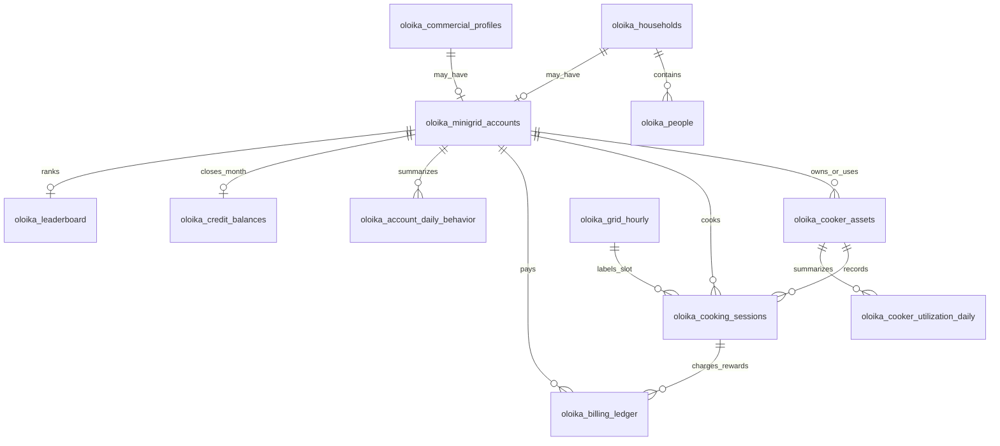

# Oloika Data Schema And Prediction Notes

This document describes the generated GridCook Oloika demo dataset, how to load it into SQLite, and whether the current historical data is enough to predict the best time to cook.

## Quick Commands

Generate the linked June 2025 files:

```bash
python3 apps/api/scripts/generate_oloika_personas.py --seed 42
python3 apps/api/scripts/generate_oloika_monthly_data.py --seed 42
```

Load the CSV files into SQLite:

```bash
python3 apps/api/scripts/load_oloika_dataset_sqlite.py --replace
```

Open the dashboard locally:

```bash
python3 -m http.server 8080
```

Then visit:

```text
http://127.0.0.1:8080/data_dashboard.html
```

## Historical Data Status

Yes, the project has historical data for June 2025.

Observed historical sources:

- `HA_Oloika.sqlite`: smart-plug telemetry used to extract observed cooking sessions from plugs `002`, `006`, `010`, `011`, `013`, `015`, `017`, and `018`.
- `OloikaMinigridUniversityofSouthampton_Victron_June_2025.csv`: mini-grid system telemetry, including battery, load, PV, voltage, and alarm-style fields where present.
- `OLOIKA_MINIGRID-MAGADI_FRONIUS_June_2025.xlsx`: PV inverter and power-meter telemetry used as another grid signal source.

Generated or synthetic sources:

- The 2,000-person village population is synthetic.
- Household and commercial personas are synthetic but grounded in the project assumptions.
- Most account-level monthly behavior is synthetic because observed smart-plug traces only cover a small set of plugs.
- Credit purchases, rewards, and leaderboard scores are generated demo data.

Current generated summary:

- `720` hourly grid rows for June 2025.
- `2,740` cooking sessions.
- `157` observed smart-plug sessions.
- `2,583` synthetic profile sessions.
- `84` mini-grid accounts.
- `87` cooker assets.
- `84` leaderboard rows.

## Can We Predict The Best Time To Cook?

For a 3-day hackathon MVP, yes. The current data is enough to build a convincing recommendation engine using a rules-first model or a lightweight supervised model.

Best MVP prediction target:

- Predict a per-account, per-cooker, per-hour slot score.
- Convert score to `green`, `orange`, or `red`.
- Estimate expected credits and expected kWh.

Useful available features:

- Grid hour: hour of day, day, PV power, load, battery SOC, voltage, alarm count.
- User behavior: historical session hour, duration, kWh, green share, red-window sessions.
- Persona profile: household/commercial type, fuel stack, equipment, meal windows, shiftability.
- Billing state: current credits, credits earned, credits spent, top-up history.
- Cooker state: cooker ID, observed smart-plug source or synthetic profile source, utilization.

Recommended MVP approach:

1. Use explainable rules for the demo:
   - Green: 10:00-15:00 when PV/SOC are favorable and load is not stressed.
   - Orange: shoulder periods that are usable but less optimal.
   - Red: evening/night periods with higher grid stress or low reward.
2. Train a small model only after the rule baseline works:
   - Classification target: `slot_color`.
   - Regression target: expected kWh or expected credits.
   - Suggested models: logistic regression, random forest, or gradient boosting.
3. Keep the app explanation rule-based:
   - Example: "High solar, battery healthy, low community load, cooker available."

Not enough yet for production-grade prediction:

- More than one month of historical telemetry.
- Real account-to-household consented labels.
- Real booking and payment behavior.
- Weather and solar forecasts.
- Outage, maintenance, and voltage-quality labels.
- Actual health outcome data. Current health fields are only proxies.

## Dataset Files

| File | Purpose |
| --- | --- |
| `data/synthetic/oloika_people.csv` | Synthetic people in the village population. |
| `data/synthetic/oloika_households.csv` | Synthetic household cooking personas. |
| `data/synthetic/oloika_commercial_profiles.csv` | Synthetic restaurant and food-vendor personas. |
| `data/synthetic/oloika_minigrid_accounts.csv` | 84 linked mini-grid accounts. |
| `data/synthetic/oloika_grid_hourly_june_2025.csv` | Hourly June 2025 grid features derived from historical telemetry. |
| `data/synthetic/oloika_cooker_assets.csv` | Cooker IDs, smart-plug mappings, and synthetic cooker assets. |
| `data/synthetic/oloika_cooking_sessions_june_2025.csv` | Observed and synthetic cooking sessions. |
| `data/synthetic/oloika_cooker_utilization_daily_june_2025.csv` | Daily active minutes and utilization by cooker. |
| `data/synthetic/oloika_account_daily_behavior_june_2025.csv` | Daily account-level behavior features. |
| `data/synthetic/oloika_billing_ledger_june_2025.csv` | Prepaid top-ups, cooking charges, and rewards. |
| `data/synthetic/oloika_credit_balances_june_2025.csv` | End-of-month credit balances. |
| `data/synthetic/oloika_leaderboard_june_2025.csv` | Monthly leaderboard data. |
| `data/synthetic/oloika_dataset_schema.json` | Machine-readable schema for generated monthly files. |
| `data/synthetic/oloika_monthly_dataset_summary.json` | Summary counts for charts and QA. |

## Relationship Model



## SQLite Loader Script

The repository includes a loader:

```bash
python3 apps/api/scripts/load_oloika_dataset_sqlite.py --replace
```

Default output:

```text
data/synthetic/oloika_demo.sqlite
```

Optional custom path:

```bash
python3 apps/api/scripts/load_oloika_dataset_sqlite.py \
  --db-path data/synthetic/gridcook_demo.sqlite \
  --replace
```

Example query after loading:

```bash
sqlite3 data/synthetic/oloika_demo.sqlite \
  "select rank, display_name, score, green_window_share, credits_earned from oloika_leaderboard limit 10;"
```

## Equivalent SQLite Import Commands

If using the SQLite CLI directly:

```sql
.mode csv
.import --skip 1 data/synthetic/oloika_people.csv oloika_people
.import --skip 1 data/synthetic/oloika_households.csv oloika_households
.import --skip 1 data/synthetic/oloika_commercial_profiles.csv oloika_commercial_profiles
.import --skip 1 data/synthetic/oloika_minigrid_accounts.csv oloika_minigrid_accounts
.import --skip 1 data/synthetic/oloika_grid_hourly_june_2025.csv oloika_grid_hourly
.import --skip 1 data/synthetic/oloika_cooker_assets.csv oloika_cooker_assets
.import --skip 1 data/synthetic/oloika_cooking_sessions_june_2025.csv oloika_cooking_sessions
.import --skip 1 data/synthetic/oloika_cooker_utilization_daily_june_2025.csv oloika_cooker_utilization_daily
.import --skip 1 data/synthetic/oloika_account_daily_behavior_june_2025.csv oloika_account_daily_behavior
.import --skip 1 data/synthetic/oloika_billing_ledger_june_2025.csv oloika_billing_ledger
.import --skip 1 data/synthetic/oloika_credit_balances_june_2025.csv oloika_credit_balances
.import --skip 1 data/synthetic/oloika_leaderboard_june_2025.csv oloika_leaderboard
```

The Python loader is safer because it creates the tables with basic numeric types before inserting rows.

## Database Schema

The generated schema source of truth is:

```text
data/synthetic/oloika_dataset_schema.json
```

Core relational schema:

```sql
CREATE TABLE oloika_minigrid_accounts (
  account_id TEXT PRIMARY KEY,
  account_type TEXT NOT NULL,
  entity_id TEXT NOT NULL,
  community_id TEXT NOT NULL,
  meter_status TEXT NOT NULL
);

CREATE TABLE oloika_cooker_assets (
  cooker_id TEXT PRIMARY KEY,
  account_id TEXT NOT NULL REFERENCES oloika_minigrid_accounts(account_id),
  entity_id TEXT NOT NULL,
  account_type TEXT NOT NULL,
  plug TEXT,
  observed_group TEXT,
  asset_type TEXT NOT NULL,
  source TEXT NOT NULL
);

CREATE TABLE oloika_grid_hourly (
  timestamp_hour TEXT PRIMARY KEY,
  date TEXT NOT NULL,
  hour_eat INTEGER NOT NULL,
  battery_soc_percent REAL,
  battery_power_w REAL,
  pv_dc_power_w REAL,
  pv_ac_power_w REAL,
  fronius_pv_power_w REAL,
  ac_load_w REAL,
  fronius_consumption_w REAL,
  voltage_avg_v REAL,
  system_alarm_count INTEGER,
  slot_color TEXT NOT NULL,
  source TEXT NOT NULL
);

CREATE TABLE oloika_cooking_sessions (
  session_id TEXT PRIMARY KEY,
  account_id TEXT NOT NULL REFERENCES oloika_minigrid_accounts(account_id),
  entity_id TEXT NOT NULL,
  account_type TEXT NOT NULL,
  cooker_id TEXT NOT NULL REFERENCES oloika_cooker_assets(cooker_id),
  plug TEXT,
  observed_group TEXT,
  source TEXT NOT NULL,
  start_at TEXT NOT NULL,
  end_at TEXT NOT NULL,
  date TEXT NOT NULL,
  start_hour_eat INTEGER NOT NULL,
  duration_minutes REAL NOT NULL,
  kwh REAL NOT NULL,
  avg_w REAL,
  peak_w INTEGER,
  slot_color TEXT NOT NULL,
  shifted_daytime INTEGER NOT NULL
);

CREATE TABLE oloika_account_daily_behavior (
  account_id TEXT NOT NULL REFERENCES oloika_minigrid_accounts(account_id),
  entity_id TEXT NOT NULL,
  account_type TEXT NOT NULL,
  date TEXT NOT NULL,
  sessions INTEGER NOT NULL,
  kwh REAL NOT NULL,
  preferred_cooking_hour TEXT,
  green_window_share REAL NOT NULL,
  red_window_sessions INTEGER NOT NULL,
  shifted_daytime_sessions INTEGER NOT NULL,
  credits_earned INTEGER NOT NULL,
  credits_spent INTEGER NOT NULL,
  fuel_stacking_risk_flag INTEGER NOT NULL,
  green_sessions INTEGER NOT NULL,
  orange_sessions INTEGER NOT NULL,
  red_sessions INTEGER NOT NULL,
  PRIMARY KEY (account_id, date)
);

CREATE TABLE oloika_billing_ledger (
  ledger_id TEXT PRIMARY KEY,
  account_id TEXT NOT NULL REFERENCES oloika_minigrid_accounts(account_id),
  event_type TEXT NOT NULL,
  session_id TEXT REFERENCES oloika_cooking_sessions(session_id),
  credits_delta INTEGER NOT NULL,
  cash_kes INTEGER NOT NULL,
  balance_after INTEGER NOT NULL,
  reason TEXT NOT NULL,
  created_at TEXT NOT NULL
);

CREATE TABLE oloika_credit_balances (
  account_id TEXT NOT NULL REFERENCES oloika_minigrid_accounts(account_id),
  account_type TEXT NOT NULL,
  entity_id TEXT NOT NULL,
  month TEXT NOT NULL,
  ending_balance_credits INTEGER NOT NULL,
  total_top_up_credits INTEGER NOT NULL,
  total_reward_credits INTEGER NOT NULL,
  total_spent_credits INTEGER NOT NULL,
  cash_paid_kes INTEGER NOT NULL,
  PRIMARY KEY (account_id, month)
);

CREATE TABLE oloika_leaderboard (
  rank INTEGER PRIMARY KEY,
  account_id TEXT NOT NULL REFERENCES oloika_minigrid_accounts(account_id),
  entity_id TEXT NOT NULL,
  account_type TEXT NOT NULL,
  display_name TEXT NOT NULL,
  leaderboard_group TEXT NOT NULL,
  sessions INTEGER NOT NULL,
  kwh REAL NOT NULL,
  green_sessions INTEGER NOT NULL,
  orange_sessions INTEGER NOT NULL,
  red_sessions INTEGER NOT NULL,
  green_window_share REAL NOT NULL,
  shifted_daytime_sessions INTEGER NOT NULL,
  credits_earned INTEGER NOT NULL,
  credits_spent INTEGER NOT NULL,
  ending_balance_credits INTEGER NOT NULL,
  cash_paid_kes INTEGER NOT NULL,
  fuel_stacking_risk_days INTEGER NOT NULL,
  score INTEGER NOT NULL,
  privacy_level TEXT NOT NULL
);
```

Persona tables are wider and generated directly from the CSV headers:

- `oloika_people`
- `oloika_households`
- `oloika_commercial_profiles`

Use `data/synthetic/oloika_dataset_schema.json` for the exact generated columns.

## Leaderboard Scoring

Leaderboard score is generated from monthly account behavior:

```text
score =
  credits_earned
  + green_sessions * 6
  + orange_sessions * 2
  + shifted_daytime_sessions * 8
  - red_sessions * 4
```

The leaderboard uses synthetic IDs only:

- `Household HH-xxxx`
- `Business BIZ-xxx`

This is intentional. It avoids implying that the project contains real resident names or real private payment behavior.
